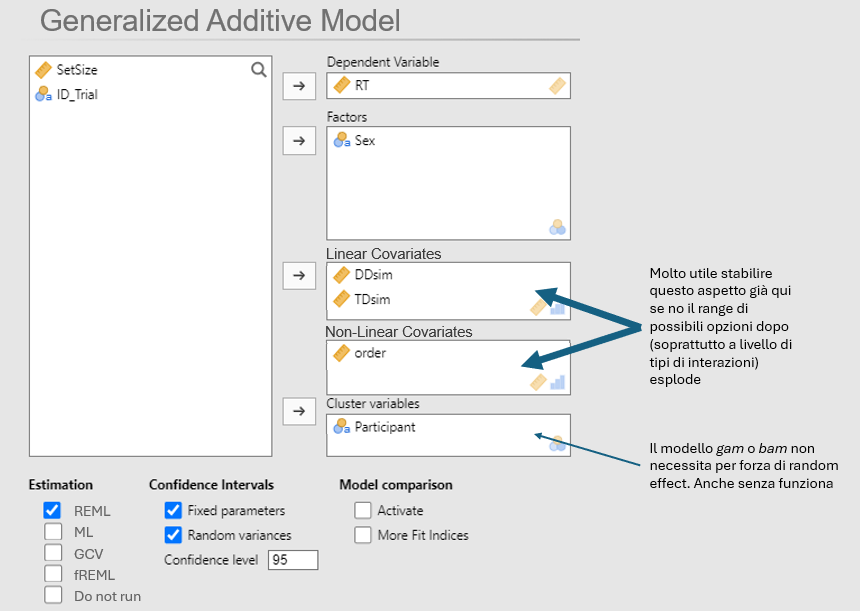
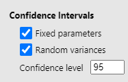
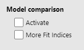
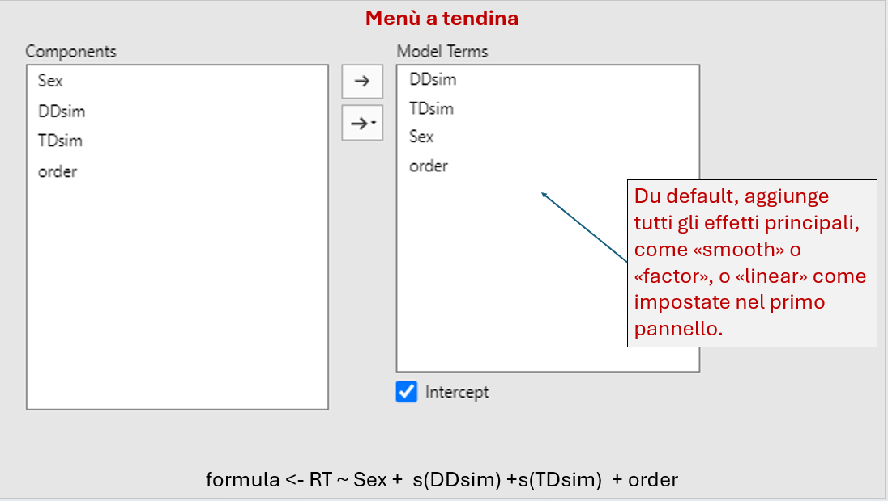
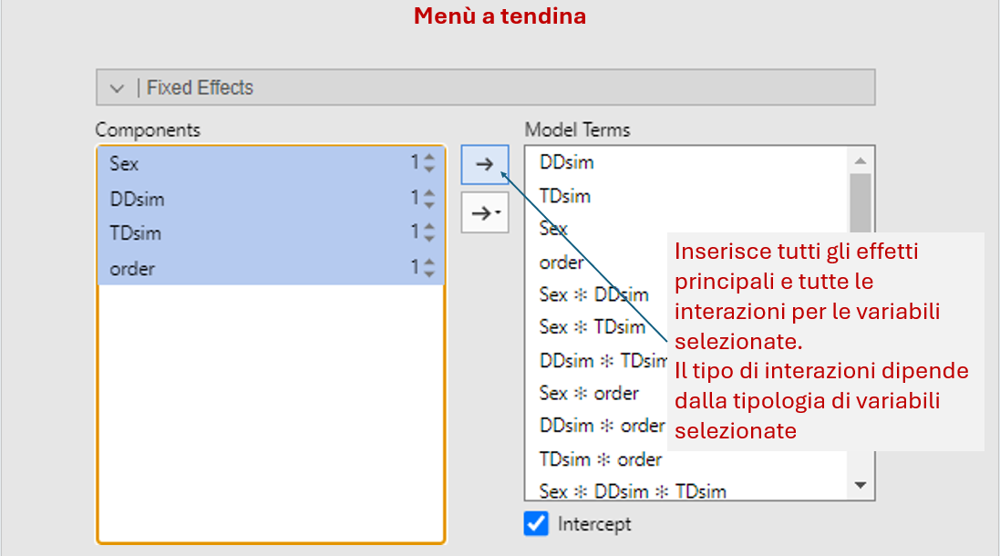
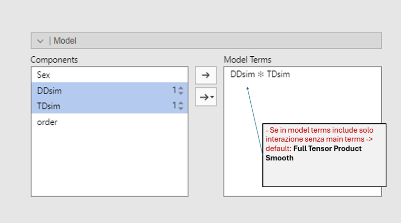
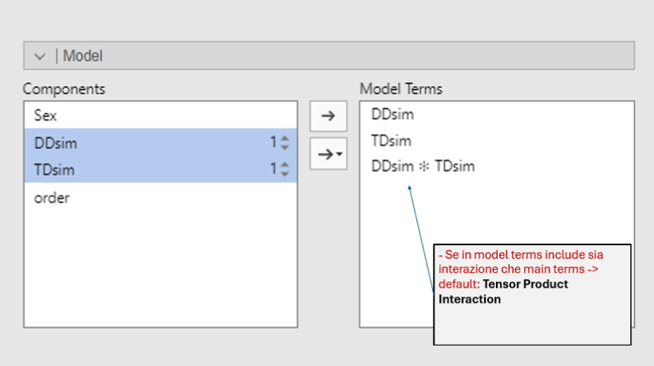
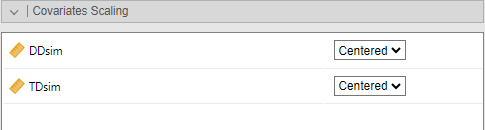
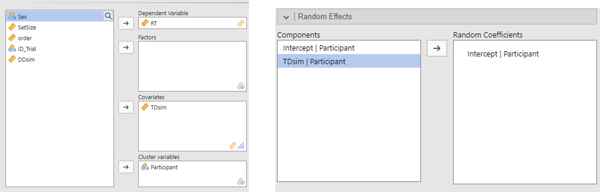
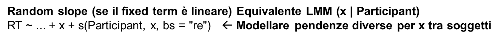

============================================================

This file contains internal notes, ideas, and TODOs.

For collaborators only.

============================================================

## Dataset Esempio

```{r}
#  Pacchetti
rm(list = ls())
library(mgcv)
library(visreg)
library(itsadug) 
library(gratia)
library(dplyr)

load("DB_visualsearchbasic.RData")

head(df)

```

# Panel 1 - GAM - Model Specification



## Family

Per ora focus su family = gaussian (default in mgcv, Continua \~ simmetrica )

Ma considerare però eventualmente anche altre family disponibili in mgcv: Gamma (RT \> 0, asimmetrica), inverse.gaussian (RT molto asimmetrica), binomial (Binaria (0/1)), poisson (Conteggi), betar (Proporzioni (0–1)).

```{r}
formula <- RT ~ s(TDsim) + DDsim+ te(TDsim,order)+ Sex
mod <- gam(formula, data = df,family = gaussian(link = "identity"))
summary(mod)
                                     
```

## Estimation (metodo selezione parametri smoothing)

```{r}
formula <- RT ~ s(TDsim)

## Likelihood Based Methods ## Restricted Maximum Likelihood
mod <- gam(formula, data = df,family = gaussian(), method = "REML"); 
mod <- gam(formula, data = df, method = "ML"); # per completezza
mod <- bam(formula, data = df, method = "fREML"); 

## Prediction Error Criteria Methods # Generalized Cross Validation
mod <- gam(formula, data = df, method = "GCV.Cp");
summary(mod)
```

**Scelta:**

**REML**: Default consigliato per uso generale se stai stimando la smoothness ottimale di un modello, descritta come più stabile e meno soggetta all'overfitting (Wood, 2017, p.266–267).

**ML** o **GCV** per confrontare modelli con fixed effects diversi ad esempio, confrontare un modello con s(x) + s(z) contro uno con solo s(x)) (REML no, vedi mgcv::gam.selection)

**bam**() con method = "**fREML**" per dataset molto grandi altrimenti preferire GAM che è derscitto come più robusto e garantisce quasi sempre la convergenza del modello (dipende dalla RAM, ma in ongi caso da considerare a partire da decine di migliaia di righe in su per arrivare fino a 100 milioni di dati, in alcuni casi circa 100 volte più veloce). (Wood, et al., 2015 Generalized additive models for large data sets; Wood 2017 Generalized Additive Models for Gigadata).

# Confidence intervals



Per gli **effetti parametrici**: si può fare la tabella con il nome del parametro, la stima del coefficiente, l’errore standard e l’intervallo di confidenza (inferiore e superiore).

Per gli **effetti smooth**, mostrare le **componenti di varianza** stimate associate a ciascun termine smooth con **`gam.vcomp`** (più precisamente l'output da deviazione standard stimata come misura di quanto pesa quella componente: `std.dev = mod$scale / mod$sp`). Fornisce anche **intervalli di confidenza** (se la stima è effettuata tramite ML o REML).\

```{r}
# valutare gam.vcomp 
mod <- gam(RT ~ s(DDsim)+s(TDsim)+ order+s(Participant, bs="re"), data = df,method = "REML")
summary(mod)
gam.vcomp(mod, conf.lev=.95) 
# It also provides confidence intervals, if smoothness estimation is by ML or REML.
# R converte la wiggliness delle funzioni DDsim e TDsim in una metrica di varianza (comparabile agli effetti random).

# nell'esempio sotto: La variazione nella variabile dipendente causata da DDsim è molto forte rispetto a quella causata dai Partecipanti (0.08) o dal rumore (0.44). TDsim (23.47) anche questo è un effetto molto grande, ma molta incertezza nella stima (vedi CI)

```

## Model Comparison - Fit Indices



AIC, BIC, logLik con More Fit Indices.

EDF complessivi forse.

### Output di base

```{r}
formula <- RT ~ s(TDsim) 
mod <- gam(formula, data = df, method = "REML"); 
summary(mod) 
```

**Deviance explained (%)** proporzione di variabilità dei dati spiegata dal modello GAM. Analogo del R², ottenuto confrontando la deviance del modello con quella del modello nullo (solo intercetta, nessun predittore).

```{r}
summary(mod)$dev.expl 
summary(mod)$dev.expl * 100   # percentuale}
```

**R-sq.(adj)** generalizzazione dell'R2 usato nella regressione lineare standard, aggiustato per il numero di parametri stimati nel modello (EDF).

```{r}
summary(mod)$r.sq # adj r square
```

**Smoothing parameter selection score:** Riporta il valore del criterio che è stato minimizzato per selezionare il grado di smoothing ottimale dei termini smooth (Con i metodi REML, fREML e ML, poiché gli algoritmi di ottimizzazione tendono a minimizzare, il valore riportato è il negativo della log-likelihood penalizzata, con il metodo GCV.Cp, invece, riporta il valore del criterio GCV ).

Quindi interpretazione: più è basso, meglio è per la selezione della levigatezza.

```{r}
mod$gcv.ubre   # Smoothing parameter selection score: criterio minimizzato -ML, -REML o GCV a seconda del metodo scelto 
```

**Scale estimate:** Stima della varianza residua del modello (σ²).

```{r}
mod$scale 
# Scale estimate: sum(residuals(mod)^2) / mod$df.residual  # dfresidui=n−edf totali

# La radice quadrata della scale corrisponde alla deviazione standard residua: sqrt(mod$scale).
# Nell’output di summary.gam:
#   Scale est. = 0.2000527  -> varianza residua
# Nell’output di gam.vcomp:
#   scale = 0.4472725       -> deviazione standard residua
```

### More fit indices

**AIC & BIC**: Indice che bilancia log-likelihood (quanto bene il modello spiega i dati) e la complessità del modello (numero di parametri o, nei GAM, gli edf). È direttamente paragonabile tra modelli strutturalmente diversi che sono stimati sugli stessi dati es. y \~ s(x) *vs* y \~ s(x) + z (anche GLM vs GAM).

```{r}
AIC(mod) BIC(mod)
```

**Log-Likelihood:** restituisce la Log-Likelihood non penalizzata del modello, valutata in corrispondenza dei parametri di smoothness (λ) e dei coefficienti (β​) stimati.

```{r}
logLik(mod)
```

**Model complexity**: Gli EDF riflettono quanti parametri “liberi” servono per descrivere la curva.\
Un polinomio di ordine 1 = 1 pendenza → EDF \~1\
Una curva più complessa → EDF \~3–5.\
La somma degli EDF di tutti i termini parametrici e smooth dà la complessità effettiva complessiva del modello e viene usata da AIC, BIC, R² adj, GCV / UBRE come penalizzazione contro modelli troppo complessi.

```{r}
edf_tot <- sum(mod$edf)         # Model complexity: edf complessivi dell’intero modello edf_smooth <- sum(summary(mod)$s.table[ , "edf"])  # Model complexity: solo per gli smooth 
```

## Model Comparison - Activate

**anova.gam**: capire se un modello più complesso è significativamente migliore di uno più semplice (modelli sono annidati, stimati sugli stessi dati).

```{r}
m1 <- gam(RT ~ s(TDsim), data = df, method = "ML"); 
m2 <- gam(RT ~ s(TDsim)+s(DDsim), data = df, method = "ML");  
anova.gam(m1,m2,test="F")
```

**AIC comparison**: differenza AIC

```{r}
m1 <- gam(RT ~ s(TDsim), data = df, method = "ML"); 
m2 <- gam(RT ~ s(TDsim)+s(DDsim), data = df, method = "ML");  
AIC(m1,m2)
AIC(m1)-AIC(m2)
```

**gcv.ubre comparison**: confronto tra smoothing parameter selection score. Criterio minimizzato -ML, -REML o GCV a seconda del metodo scelto.

```{r}
m1 <- gam(RT ~ s(TDsim), data = df, method = "ML"); 
m2 <- gam(RT ~ s(TDsim)+s(DDsim), data = df, method = "ML");  
m1$gcv.ubre
m2$gcv.ubre
```

Note: In general the most logically consistent method to use for deciding which terms to include in the model is to compare GCV/UBRE/ML scores for models with and without the term (REML scores should not be used to compare models with different fixed effects structures) *(Wood, 2023, Interactive term selection, mgcv manual, sezione “Interactive term selection”)*

# Fixed Effects

## Effetti principali



Il modello include tutti gli effetti principali specificati nel primo pannello, come *smooth*, *factor* o *linear*, così come impostati nel primo pannello Fixed Effects.

Per ***factor*** o ***linear covariates***, la formula in R è uguale a quella utilizzata nei GLM. La variabile categorica (Sex) come effetto principale non produce una curva distinta per ogni gruppo ma uno *shift* costante dell’intercetta tra i gruppi lungo l’intera curva di TDsim e DDsim. Le variabili continue lineari (order) aggiungono un effetto con pendenza costante che si somma all’effetto degli smooth terms.

Per gli ***smooth*** si specifica nella formula `s()`. La forma della relazione è flessibile. Il termine smooth consente di modellare la relazione tra la variabile continua e l’outcome senza imporre una forma predefinita

Esempio:

```{r}
formula <- RT ~ order + Sex

# equivalente nei risultati a lm
mod_gam <- gam(formula, data = df);
mod_lm <- lm(formula, data = df)
anova(mod_gam) 
car::Anova(mod_lm, type = 3) 
summary(mod_gam) 
summary(mod_lm)

```

```{r}

formula <- RT ~  s(DDsim) + s(TDsim) + order + Sex
mod <- gam(formula, data = df);

# Per smooth terms sia con anova che summary riportano F test:

anova(mod) # o anova.gam(mod);
# Riporta F test per tutti i termini, paramteric e  smooth.
# ANOVA di Tipo III, test di Wald per ciascun termine parametrico e smooth. 

summary(mod) # o summary.gam(mod). 
# Riporta F test per smooth terms + test t per parametric terms.
```

## Interazioni



A seconda delle variabili in interazione la formula cambia

### Solo smooth interaction terms

Rilevanti: `te()` e `ti()`.\
Altro: `t2()` alternativa di `te()` con dati sparsi distribuiti in modo non uniforme (impostabile solo tramite script).

I termini basati su prodotti tensoriali (`te()` e `ti()`) sono progettati per essere **invarianti alla riscalatura lineare** dei predittori (Wood, 2006).

#### A) Full Tensor Product Smooth



**`te(x, z)`** Stima una superficie non lineare su 2+ variabili. **Include automaticamente effetti principali + interazione nello stesso termine** **smooth**. Puoi vedere la forma totale della superficie, ma **non puoi testare separatamente main effects e interazione.**

La superficie risultante permette di stimare come i predittori si combinano in modo flessibile lungo due dimensioni. Il *tensor product smooth* `te()` è **invariante alla scala**: “The tensor product smooths are invariant to linear rescaling of covariates” ed è progettato per modellare una relazione bidimensionale quando le variabili possono avere scale diverse o richiedere basi differenti.

Funziona anche con tre o più variabili, come ad esempio `te(x, z, y, k=c(5, 5, 5))` . Attenzione a esplosione dei parametri: la dimensione totale della base è il prodotto dei singoli k. Se usi k=10 per tre variabili, il modello dovrà stimare 10 \* 10 \* 10 = 1000 parametri.

```{r}
formula <- RT ~ te(TDsim, DDsim)  #te -> Un’unica superficie multidimensionale (main effects + interaction insieme)
mod <- gam(formula, data = df, method = "REML"); 
anova(mod); 
summary(mod);

# visualisation
plot.gam(mod, pages = 1,  all.terms = TRUE, residuals = TRUE, shade = TRUE)
vis.gam(mod,
  view      = c("TDsim", "DDsim"),
  plot.type = "persp",   # "contour", "persp", "slice"
  type      = "response",
  n.grid    = 50,
  too.far   = 0.1)
```

#### B) Tensor Product Interaction



**`ti(x, z)`** Approccio ANOVA: **ti(x) + ti(z) + ti(x,z)** produce effetti principali e interazione non lineare ben separati. Nel termine ti(x,z) le componenti marginali vengono rimosse, così l’interazione rappresenta solo variazioni congiunte di x e z.\
I termini ti() sono costruiti applicando vincoli di centraggio (sum-to-zero) alle basi marginali prima di costruire il prodotto tensoriale (Wood, 2017). Questo garantisce matematicamente che l'interazione ti(x, z) sia **ortogonale** agli effetti principali, permettendoti di testare se l'interazione aggiunge effettivamente valore oltre agli effetti singoli (Wood, 2006).

L'uso tipico di `ti()` è per una **decomposizione ANOVA funzionale**. Ad esempio, per modellare un'interazione pura tra due covariate continue x e z, **si usa `ti(x,z)` solo dopo aver specificato separatamente gli effetti principali f1​(x) e f2​(z)** (ad esempio, con s(x) + s(z) o ti(x) + ti(z)) (Wood (2017, section 5.6.3)).

La funzione `ti()` è specificamente **progettata per produrre termini di smooth (sia principali che di interazione) che escludono i termini di ordine inferiore**. Questo garantisce che ogni termine nel modello sia ben distinto dagli altri e che l'interazione `ti(TDsim, DDsim)` sia pura (cioè, non contiene tracce degli effetti principali) (R documentation).

I termini `s()` (come `s(TDsim)`) sono di default soggetti a vincoli di centraggio (hanno media zero) per renderli identificabili rispetto all'intercetta del modello. Poiché l'obiettivo di **`ti()`** (creare un'interazione ortogonale) e l'obiettivo di **`s()`** (creare un effetto principale centrato) non sono in conflitto, è possibile utilizzare i termini `s()` al posto dei termini `ti()` per gli effetti principali in questa struttura (R documentation). L'uso di tutti i termini ti() `(ti(TDsim) + ti(DDsim) + ti(TDsim, DDsim))` è generalmente considerato la specifica più appropriata ma in realtà non cambia molto: "The single s terms *( s(X,k=10,bs="cr") )* could have been replaced by terms ti(X,k=10) *(tensor interaction)* resulting in the same model fit" (*Wood, 2017, Generalized additive models, p. 335)*.

```{r}
# Nel modello, ti(DDsim) e ti(TDsim) catturano le curvature individuali di ciascun predittore continuo, mentre ti(TDsim, DDsim) rappresenta la parte congiunta della relazione, cioè la variazione che emerge solo quando i due predittori vengono considerati insieme. 
formula <- RT ~ ti(TDsim, DDsim)+ti(DDsim)+ti(TDsim) 

mod <- gam(formula, data = df, method = "REML"); 
summary(mod); 

# visualisation
plot.gam(mod, pages = 1,  all.terms = TRUE, residuals = TRUE, shade = TRUE)
vis.gam(mod,
  view      = c("TDsim", "DDsim"),
  plot.type = "persp",   # "contour", "persp", "slice"
  type      = "response",
  n.grid    = 50,
  too.far   = 0.1)

```

### Solo parametric terms interactions

I termini parametrici nei GAM usano la stessa sintassi dei modelli lineari.

#### A) Covariate × Covariate

In GAMLJ le covariate continue sono centrate alla media di default quando in interazione. Farei anche nei gam per stesse ragioni.



```{r}

df$DDsim_c=scale(df$DDsim,center = TRUE,scale = FALSE)
df$TDsim_c=scale(df$TDsim,center = TRUE,scale = FALSE)

formula <- RT ~ DDsim_c * TDsim_c
mod_lm <- lm(formula, data = df)
car::Anova(mod_lm, type = 3) 
summary(mod_lm)

mod <- gam(formula, data = df, method = "REML")
anova(mod)
summary(mod)

```

#### B) Factor × Factor

In GAMLj il default per le variabili categoriche è il Simple coding: “The default coding schema is simple, which is centered to zero and compares each means with the reference category mean. The reference category is the first appearing in the variable levels”

Per essere coerenti con GAMLj anche nei GAM con soli termini parametrici, conviene quindi usare contrasti centrati anche per i fattori, invece della dummy coding standard di R.

Simple e dummy danno gli stessi confronti tra medie, ma quando c’è un’interazione cambiano il significato dei coefficienti degli altri termini: con simple gli effetti sono mediati sul campione, con dummy sono riferiti al gruppo di riferimento.

```{r}
df=df
df$Sex_sc <- factor(df$Sex)
df$condition_sc <- factor(df$condition)

# GAMLj-like simple coding (centered to zero)
contrasts(df$Sex_sc) <- contr.treatment(nlevels(df$Sex_sc)) - 1 / nlevels(df$Sex_sc)
contrasts(df$condition_sc) <- contr.treatment(nlevels(df$condition_sc)) - 1 / nlevels(df$condition_sc)
# contrasts(df$Sex) <- contr.treatment(nlevels(df$Sex)) # Dummy
# contrasts(df$condition) <- contr.treatment(nlevels(df$condition))# Dummy

formula <- RT ~ Sex_sc * condition_sc
mod_lm <- lm(formula, data = df)
car::Anova(mod_lm, type = 3)
summary(mod_lm)

mod <- gam(formula, data = df, method = "REML")
anova(mod)
summary(mod)

contrasts(df$Sex)
```

#### C) Factor × Covariate

```{r}
formula <- RT ~ DDsim_c * condition_sc
mod <- gam(formula, data = df, method = "REML")
anova(mod)
summary(mod)
```

### Smooth by parametric

Non si permetterà l'inserimento di interazioni **sopra il secondo ordine** (tre termini o più) che coinvolgano variabili parametriche.

#### A1) Smooth-by-factor (Unordered)

Con by fattoriale si ottengono smooth separate per livello. Con by fattoriale, mgcv costruisce una smooth per livello e queste smooth risultano centrate.

**Struttura del Modello:** `y ~ fac + s(x, by =  fac)`

-   **necessario includere l'effetto principale della variabile parametrica** (il fattore) per catturare le differenze di intercetta/livello medio tra gruppi. Senza il fattore parametrico il modello assumerebbe che tutti i gruppi abbiano lo stessa media nella variabile dipendente, portando a stime distorte. Il termine agisce come un'intercetta specifica per ogni gruppo, spostando la curva centrata verso l'alto o verso il basso fino al livello medio reale del gruppo.

-   **non va incluso l'effetto princiale della variabie smooth** perchè Smooth-by-factor sta già chiedendo di stimare una curva completa per ogni livello del fattore e aggiungere un altro termine smooth come "effetto principale", il modello si troverebbe con informazioni per lo stesso andamento -\> collinearità.

**Nota: Centrare le variabili continue o cambiare i contrasti non cambia la "morbidezza" o la forma delle curve.** L'unica cosa che cambia è l'interpretazione dell'intercetta nei parametric coefficients, ma non la sostanza del fit.

```{r}
# Case 1A: Factor by variables.

# condition + s(TDsim, by = condition)
# = differenze medie tra gruppi (termine parametrico condition)
#   + una smooth separata di TDsim per ciascun livello di condition.
formula <- RT ~ condition +  s(TDsim, by = condition)
mod <- gam(formula, data = df, method = "REML");

# In anova(mod):
# - condition testa il fattore come termine parametrico complessivo i gruppi 
#    differiscono nel livello medio di RT?) 
# - ogni s(TDsim):conditionX testa la smooth del singolo gruppo (la curva associata 
#    a TDsim all’interno di ciascuna condizione è diversa da zero - linea piatta?).
anova(mod) 

# In summary(mod):
# - Parametric coefficients: 
#   Intercept = valore medio atteso del gruppo di riferimento
#   Coeff parametrici confrontano i gruppi condition 2 e 3 con il riferimento
# - le smooth descrivono la forma della relazione in ciascun gruppo come sopra
summary(mod) ;

# visualisation
plot.gam(mod, pages = 1,  all.terms = TRUE, residuals = TRUE, shade = TRUE)


# formula <- RT ~ condition_sc +  s(TDsim_c, by = condition_sc)
# mod_c <- gam(formula, data = df, method = "REML");
# anova(mod_c)
# summary(mod_c)
```

```{r}
# Nota: se si vuole che le curve abbiano stessa scorrevolezza tra livelli, usa id=1 (stesso smoothing parameter per tutti i livelli).

formula <- RT ~ condition +  s(TDsim, by = condition, id=1)
mod <- gam(formula, data = df, method = "REML");
anova(mod)
summary(mod)

# visualisation
plot.gam(mod, pages = 1,  all.terms = TRUE, residuals = TRUE, shade = TRUE)
```

#### A2) Smooth-by-factor (ordered)

La formulazone è simile alla situazione Smooth-by-factor unordered. Però nell'unordered il modello stima una curva completa e indipendente per ogni livello del fattore . Non puoi sapere direttamente dal summary se le curve sono diverse tra loro .

Quando il **fattore Ordinato (Ordered)** il modello stima una curva di "riferimento" (per il primo livello) e poi delle curve di differenza per tutti gli altri livelli . Queste curve di differenza rappresentano lo scostamento rispetto alla curva di base. Se il p-value di una "curva di differenza" è significativo nel summary(), allora la forma di quella curva è diversa da quella del gruppo di riferimento.

**Struttura del Modello:** `y ~ fac + s(x) + s(x, by =  fac)`

Differenza fondamentale nella formulazione Ordered: **aggiungere obbligatoriamente un termine smooth globale** che va a rappresentare la curva di "riferimento" per il primo livello del fattore.

-   `s(x):` Rappresenta la curva di "riferimento" per il primo livello del fattore. Se è significativo, significa che il gruppo di riferimento ha un trend non piatto.

-   `s(x, by = fattore_ord)`: Genera le curve di differenza per i livelli successivi. Se è significativo, significa che quel gruppo ha una forma della curva statisticamente diversa dal riferimento. Se non è significativo, la differenza tra i due gruppi è solo una costante verticale (catturata dall'effetto principale) o nulla.

```{r}


# Nota: se si vuole che le curve abbiano stessa scorrevolezza tra livelli, usa id=1 (stesso smoothing parameter per tutti i livelli).
df$condition_ord <- as.ordered(df$condition)
formula <- RT ~ condition_ord +   s(TDsim) + s(TDsim, by = condition_ord, id=1)
mod <- gam(formula, data = df, method = "REML");
anova(mod)
summary(mod) # in R per gli ordered factors il default non è contr.treatment, ma contr.poly, testa trend lineare, quadratico...

# visualisation
plot.gam(mod, pages = 1,  all.terms = TRUE, residuals = TRUE, shade = TRUE)
```

#### B) Sum to zero smooth interactions.

La base sz è progettata per una scomposizione di tipo ANOVA funzionale. Invece di stimare una curva indipendente per ogni gruppo, il modello divide l'effetto in due parti:

-   Effetto Principale `(s(x))`: Una curva "media" che rappresenta il trend globale di tutta la popolazione.

-   Deviazioni `(s(x, fac, bs = "sz"))`: Delle curve "correttive" che indicano come ogni gruppo si allontana dalla media globale (Wood, 2017).

Questo approccio è considerato più "naturale" rispetto ai fattori ordinati perché non richiede di scegliere un gruppo di riferimento: ogni gruppo viene confrontato con la media della popolazione.

Il vincolo Sum-to-Zero "tra i livelli": In uno smooth normale `s(x)`, il vincolo è sulla variabile x (la curva ha media zero lungo l'asse x). In `bs = "sz"`, il vincolo è **tra i gruppi**: in ogni punto del predittore x, la somma delle deviazioni di tutti i livelli del fattore deve essere esattamente zero. \
∑f gruppo ​ (x)=0 per ogni valore di x.

**Struttura del Modello:** `y ~ s(x) + s(x, fac, bs = "sz")`

**Non** **includere** **il fattore come effetto principale** parametrico se usi bs="sz". Le funzioni di base sz includono già internamente le medie dei gruppi. Se aggiungessi il fattore (es. `y ~ fac + s(x) + s(x, fac, bs="sz"`) nella formula il modello avrebbe informazioni duplicate e andrebbe in errore per rank deficiency (collinearità perfetta).

```{r}

formula <- RT ~ s(TDsim) + s(condition, TDsim, bs="sz") 
mod2 <- gam(formula, data = df, method = "REML");
anova(mod2)
# s(TDsim): Il trend globale è  non-lineare e  significativo. Esiste un andamento generale dei tempi di reazione che accomuna tutti i gruppi
# s(condition, TDsim) poiché il p-value è significativo i gruppi hanno andamenti diversi tra loro. Almeno una delle condizioni devia in modo significativo dal trend medio globale.


plot_smooth(mod2,view="TDsim",plot_all = "condition")
```

Con bs="sz", summary.gam() fornisce un test globale del termine di deviazione smooth: dice se i livelli del fattore differiscono dalla smooth principale, ma non quali coppie di livelli differiscono tra loro.

Per capire quale condizione devia in modo significativo dal trend medio globale:

-   Visualizzazione (La via più veloce): le curve di ogni livello si allontanano dallo zero. Quella che si allontana di più o che ha intervalli di confidenza che non includono lo zero è quella che devia maggiormente.

-   Derivare i contrasti tra smooth dal modello già stimato. predict.gam(type="lpmatrix") restituisce la matrice che, applicata ai coefficienti, produce i valori del predittore lineare; mgcv la propone proprio per ottenere intervalli o quantità derivate dal modello.

```{r}

# Dopo un modello con bs="sz", i confronti pairwise tra livelli
# si ottengono dal modello già stimato usando predict.gam(type="lpmatrix").
# Si predice il modello sulla stessa griglia di x per due livelli del fattore,
# si sottraggono le righe della lpmatrix e si ricavano differenza, SE e CI
# usando coef(mod) e mod$Vp.
# In questo modo la smooth globale si annulla e il contrasto isola
# la differenza tra le curve dei due livelli.

formula <- RT ~ s(TDsim) + s(condition, TDsim, bs = "sz")
mod2 <- gam(formula, data = df, method = "REML")

# griglia di TDsim
grid <- seq(min(df$TDsim, na.rm = TRUE),
            max(df$TDsim, na.rm = TRUE),
            length.out = 200)

# funzione per confronto pairwise tra due livelli del fattore
smooth_diff_sz <- function(model, xvar, facvar, lev1, lev2, grid_vals) {
  
  nd1 <- data.frame(TDsim = grid_vals, condition = factor(lev1, levels = levels(df$condition)))
  nd2 <- data.frame(TDsim = grid_vals, condition = factor(lev2, levels = levels(df$condition)))
  
  # nomi corretti delle colonne
  names(nd1) <- c(xvar, facvar)
  names(nd2) <- c(xvar, facvar)
  
  X1 <- predict(model, newdata = nd1, type = "lpmatrix")
  X2 <- predict(model, newdata = nd2, type = "lpmatrix")
  
  Xdiff <- X1 - X2
  
  fit <- as.vector(Xdiff %*% coef(model))
  se  <- sqrt(rowSums((Xdiff %*% model$Vp) * Xdiff))
  
  out <- data.frame(
    x = grid_vals,
    level1 = lev1,
    level2 = lev2,
    diff = fit,
    se = se,
    lower = fit - 1.96 * se,
    upper = fit + 1.96 * se
  )
  
  out
}

# esempi pairwise
d_3_6 <- smooth_diff_sz(mod2, "TDsim", "condition", "3", "6", grid)
d_3_9 <- smooth_diff_sz(mod2, "TDsim", "condition", "3", "9", grid)
d_6_9 <- smooth_diff_sz(mod2, "TDsim", "condition", "6", "9", grid)


plot(d_3_6$x, d_3_6$diff, type = "l", ylim = range(c(d_3_6$lower, d_3_6$upper)),
     xlab = "TDsim", ylab = "Differenza curva (3 - 6)")
lines(d_3_6$x, d_3_6$lower, lty = 2)
lines(d_3_6$x, d_3_6$upper, lty = 2)
abline(h = 0, lty = 3)

levs <- levels(df$condition)
pairs <- combn(levs, 2, simplify = FALSE)

all_diffs <- lapply(pairs, function(p) {
  smooth_diff_sz(mod2, "TDsim", "condition", p[1], p[2], grid)
})

names(all_diffs) <- sapply(pairs, function(p) paste0(p[1], "_vs_", p[2]))
```

Per derivare i contrasti (differenze) tra le curve smooth di diversi gruppi senza dover rifare il modello, la tecnica del **Linear Predictor Matrix (lpmatrix)** è la più potente e flessibile (Wood, 2017).

Ecco come procedere passo dopo passo per confrontare, ad esempio, la condizione "3" e la condizione "6" del tuo modello con base `sz`:

1\. Che cos'è la `lpmatrix`?

Quando richiedi `predict(mod2, type="lpmatrix")`, R non ti restituisce i valori predetti, ma la matrice **Xp**. Questa matrice, moltiplicata per i coefficienti del modello (β), produce il predittore lineare: η **= Xp** β (Wood, 2017; Wood et al., 2016).

2\. Procedura per il calcolo della differenza

Per trovare la differenza tra due gruppi, devi creare una "matrice di differenza" (Marra & Wood, 2012; Wood, 2013).

1.  **Crea un grid di predizione:** Genera un data frame dove la variabile continua (`TDsim`) varia su tutto il range, ma mantieni fissa la `condition` (es. prima tutta a "3", poi tutta a "6").

2.  **Ottieni le due lpmatrix:**

    -   `Xp3 <- predict(mod2, newdata = data_cond3, type = "lpmatrix")`

    -   `Xp6 <- predict(mod2, newdata = data_cond6, type = "lpmatrix")`

3.  **Calcola la matrice di differenza:** `Xp_diff <- Xp3 - Xp6`.

4.  **Stima la differenza:** `differenza_smooth <- Xp_diff %*% coef(mod2)`.

3\. Calcolo dell'Incertezza (Intervalli di Confidenza)

Per sapere se la differenza è significativa, devi proiettare la matrice di covarianza del modello (Vβ​) sulla tua differenza (Wood, 2017):

-   **Varianza della differenza:** `var_diff <- rowSums((Xp_diff %*% vcov(mod2)) * Xp_diff)`

-   **Errore Standard:** `se_diff <- sqrt(var_diff)`

A questo punto puoi calcolare l'intervallo di confidenza al 95%: **CI = differenza_smooth +/- 1.96 \* se_diff** (Marra & Wood, 2012).

4\. Interpretazione

Se l'intervallo di confidenza calcolato **non include lo zero** per certi valori di `TDsim`, allora in quei punti le curve dei due gruppi sono statisticamente diverse (Wood, 2013; Wood et al., 2016).

Questo metodo è l'analogo dei "test post-hoc" per le curve e permette di identificare con precisione *dove* i gruppi divergono lungo l'asse X (Wood, 2017).

#### C) Random wiggly curves

**bs = "fs"** Tratta le curve come interamente casuali e non obbliga il modello a dare priorità a un effetto principale globale.

Questo approccio produce una curva smooth per ciascun livello di un singolo fattore, trattando le curve come **interamente casuali**. Ciò significa che, in linea di principio, è possibile costruire un modello con un **effetto principale** più **deviazioni smooth specifiche per ciascun livello del fattore** rispetto a tale effetto. Tuttavia, il modello **non è vincolato a far sì che l’effetto principale spieghi la maggior parte della variabilità**, come invece avviene con l’approccio **"sz"**.

Questa classe produce una funzione liscia per ciascun livello di un singolo fattore. All’interno di una formula GAM questo si ottiene con qualcosa del tipo `s(x, fac, bs = "fs")`. I termini sono **completamente penalizzati**, con penalità separate su ciascuna componente dello **spazio nullo**; per questo motivo **non sono centrati** (cioè non è imposto alcun vincolo di somma a zero).

Infatti, normalmente, nei GAM, le curve vengono "centrate": il modello le obbliga ad avere una media pari a zero per non "litigare" con l'intercetta globale del modello. **Con bs = "fs":** Questa restrizione viene rimossa. Ogni curva può avere la propria altezza (intercetta) e la propria pendenza.

**Il risultato:** Un unico termine `s(x, fac, bs = "fs")` modella contemporaneamente sia le **intercette casuali** (il punto di partenza di ogni gruppo) che le **pendenze casuali** (la forma della curva per ogni gruppo).

In generale, si usa bs = "fs" per modellare molte curve individuali (una per ogni soggetto) e si vuole che il modello gestisca automaticamente quanto devono essere "lisce", trattandole come variazioni casuali di una popolazione.

"Random Curve" : Con bs = "fs", il modello permette a ogni livello del fattore di avere una forma diversa. È come dare a ogni soggetto una "morbidezza" (wiggliness) che però segue una regola comune a tutto il gruppo (Wood, 2017).

Ecco le caratteristiche principali:\
• **Efficienza con molti gruppi**: È progettato per gestire un numero elevato di livelli (es. 200 pazienti) in modo molto più veloce rispetto all'argomento `by = fattore`.\
• **Wiggliness condivisa**: Tutti i gruppi condividono lo stesso parametro di smoothing (lambda). Questo evita che i gruppi con pochi dati abbiano curve assurde (overfitting).\
• **Intercetta inclusa**: A differenza degli smooth normali, i termini `fs` non sono "centrati" (non hanno il vincolo di somma-a-zero). Questo significa che il termine modella contemporaneamente sia l'intercetta casuale che la pendenza casuale.\
• **Penalizzazione totale**: Ogni componente della curva è penalizzata. Se non c'è abbastanza segnale, la curva casuale viene spinta verso lo zero o verso una linea piatta.

Scrivere `s(Trial, Participant, bs="fs")` è come dire al software:

> *"Voglio che ogni partecipante abbia la sua curva personale di apprendimento. Questa curva può partire dove vuole, inclinarsi come vuole e curvarsi come vuole. TUTTAVIA, tratta queste curve come effetti casuali: assumi che siano tutte variazioni attorno a una forma comune (o zero) e penalizza (schiaccia verso il basso) qualsiasi deviazione estrema che non sia fortemente supportata dai dati."*

```{r}
formula <- RT ~ s(TDsim,Participant,  bs="fs", k=5) 
mod <- gam(formula, data = df, method = "REML");
anova(mod)
summary(mod)
gam.vcomp(mod)
plot(mod)

#Quando usi questa specifica, il modello compie tre azioni in una:
# 1. Intercetta Casuale: Ogni soggetto può partire da un valore diverso (es. un paziente ha una risposta base più alta di un altro).
# 2. Pendenza Casuale: Ogni soggetto può avere una reazione più o meno forte.
# 3. Wiggliness Casuale: Ogni soggetto può avere una curva con una forma leggermente diversa (più o meno "nervosa").

#Con bs="fs", aggiungere un main smooth s(x) è formalmente possibile, ma il modello non impone che l’andamento globale venga spiegato prioritariamente dal main effect: le smooth per livello possono assorbire anche componenti di livello e pendenza, rendendo l’interpretazione meno separabile.
```

# Random effects nei GAM

### 1) Random intercept semplici



```{r}
formula <- RT ~ s(TDsim) + s(Participant, bs = "re")  # bs = base spline è costruita per funzionare come un random intercept ("re" random effects). 
mod <- gam(formula, data = df, method = "REML"); summary(mod); plot.gam(mod, pages = 1,  all.terms = TRUE, residuals = TRUE, shade = TRUE)
```

Il termine s(TDsim) stima una curva unica che descrive come cambia l’outcome al variare della variabile continua, uguale per tutti i partecipanti. Il termine s(Participant, bs = "re") introduce un random effect che agisce come un random intercept: a ciascun soggetto è assegnata una deviazione dal livello medio generale, in modo molto simile a quanto si ottiene con (1 \| Participant) in un linear mixed model. Questo permette al modello di catturare differenze stabili tra soggetti (alcuni più veloci, altri più lenti in generale) senza modificare la forma della curva non lineare comune.



s(A, B, bs="re") vs. s(A, by=B, bs="re"):     ◦ Nel caso di bs="re" (effetti casuali parametrici), s(TDsim, Participant, bs="re") e s(TDsim, by=Participant, bs="re") sono matematicamente equivalenti e producono entrambi pendenze casuali non correlate, sebbene la sintassi by sia spesso preferita per chiarezza quando si definiscono random slopes
